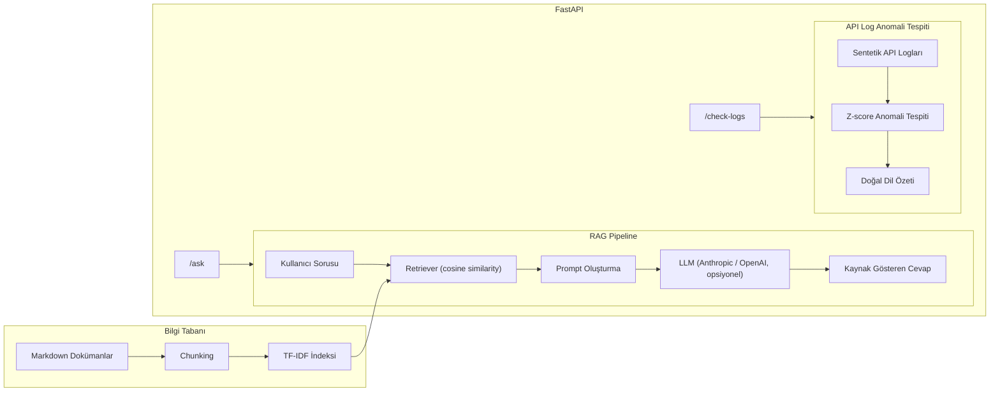

# pandas Docs Copilot — RAG Dokümantasyon Asistanı + API Log Anomali Tespiti

Bu proje, gerçek dünyadaki bir "AI Engineer" görevini simüle eden, uçtan uca çalışan iki
bileşenli bir sistemdir:

1. **RAG (Retrieval-Augmented Generation) Dokümantasyon Asistanı** — pandas kütüphanesi
   hakkında doğal dilde soru sorulduğunda, kendi yazdığım bir bilgi tabanından en alakalı
   içeriği bulup kaynak göstererek cevap üretir.
2. **API Log Anomali Tespiti** — sentetik bir "veri işleme servisi"nin (pandas tabanlı bir
   backend'i simüle eden) loglarında açıklanabilir (z-score tabanlı) anomali tespiti yapar.

Bu proje **belirli bir şirket için değil**, RAG + değerlendirme + anomali tespiti + API
entegrasyonu becerilerini genel olarak göstermek için hazırlanmıştır ve farklı domainlere
(iç dokümantasyon, mühendislik/uyumluluk metinleri, ürün dokümantasyonu vb.) kolayca
uyarlanabilir bir iskelet sunar.

## Neden Bu Tasarım Kararları?

- **TF-IDF, embedding modeli yerine.** Harici bir model deposuna (HuggingFace Hub vb.) her
  zaman erişilemeyebilecek ortamlarda bile çalışan, tamamen offline, açıklanabilir bir
  retrieval yöntemi. `Retriever` arayüzü korunarak ileride kolayca bir embedding tabanlı
  vektör veritabanına (Chroma/FAISS + OpenAI/Voyage embeddings) yükseltilebilir.
- **z-score, "black box" bir ML modeli yerine.** Bir anomalinin NEDEN öyle sayıldığının açıkça
  gösterilebilmesi (hangi metrik, kaç standart sapma) hem hata ayıklamayı kolaylaştırır hem de
  operasyon ekiplerinde güven inşa eder.
- **Sentetik veri.** Gerçek bir servisin loglarına erişimim olmadığı için, gerçekçi bir
  dağılımla (endpoint'e göre değişen gecikme/bellek profilleri, kasıtlı anomaliler) sentetik
  veri ürettim.
- **Bilgi tabanı orijinal, kendi cümlelerimle yazıldı.** pandas'ın resmi dokümantasyonunu
  kopyalamak yerine, genel pandas bilgime dayanarak kendi özet dokümanlarımı yazdım.

## Mimari



## Kurulum

```bash
git clone <bu-repo>
cd pandas-docs-assistant
python -m venv venv && source venv/bin/activate   # Windows: venv\Scripts\activate
pip install -r requirements.txt

cp .env.example .env
# .env dosyasını açıp RAG_LLM_PROVIDER ve ilgili API anahtarını girin (opsiyonel — girilmezse
# sistem sadece retrieval sonuçlarını gösterir, hata vermez)
```

## Çalıştırma

```bash
# 1) Sentetik API log verisini üret
python3 src/generate_api_logs.py

# 2) Bilgi tabanını indeksle
python3 src/build_knowledge_base.py

# 3) RAG pipeline'ını komut satırından dene
python3 src/rag_pipeline.py

# 4) Anomali tespitini dene
python3 src/anomaly_detection.py

# 5) API'yi başlat
uvicorn src.api:app --reload
# Sonra http://localhost:8000/docs adresinden interaktif olarak test edin
```

### Örnek API Kullanımı

```bash
curl -X POST http://localhost:8000/ask \
  -H "Content-Type: application/json" \
  -d '{"question": "loc ile iloc arasındaki fark nedir?"}'

curl "http://localhost:8000/check-logs?limit=5"
```

## Doğruluk Testi ve Sonuçlar

### 1) Retrieval Doğruluğu (`tests/evaluate_retrieval.py`)
15 soruluk bir test setinde (11 cevaplanabilir + 4 tuzak/cevaplanamaz soru), retrieval katmanı
**%86,7 doğruluk** elde etti. İki hata da ilginç bir ortak noktaya sahip: "GPU hızlandırması"
ve "derin öğrenme modeli eğitme" soruları, bilgi tabanında cevapları OLMAMASINA rağmen, sadece
**"pandas" kelimesini paylaştıkları için** TF-IDF tarafından yanlışlıkla alakalı bulundu. Bu,
TF-IDF'in **sözcüksel benzerlik** ile **anlamsal alakalılık** arasındaki farkı ayırt edemediğini
gösteren somut bir bulgu — embedding tabanlı bir retrieval'a geçişin (semantic search) neden
bazı durumlarda gerekli olduğuna dair kanıt sağlıyor. Tam rapor: `tests/evaluation_report.md`.

### 2) Anomali Tespit Performansı (`src/anomaly_detection.py`)
3000 satırlık sentetik log verisinde, kasıtlı olarak enjekte edilen 150 anomaliye (%5) karşı
z-score yöntemi **precision: 1.00, recall: 0.84, F1: 0.91** elde etti. Precision'ın mükemmel
olması (hiç yanlış alarm yok), ama recall'ın %100 olmaması, bazı hafif anomalilerin eşik
değerinin altında kaldığını gösteriyor — bu, eşik ayarının (2.5 standart sapma) bilinçli bir
hassasiyet/kesinlik dengesi tercihi olduğunu ortaya koyuyor.

## Sınırlamalar (Bilinçli Olarak Belirtilmiştir)

- TF-IDF, anlamsal olarak alakasız ama kelime dağarcığı örtüşen sorularda yanlış pozitif
  üretebiliyor (yukarıda detaylandırıldı) — üretimde embedding tabanlı retrieval'a geçiş
  önerilir.
- LLM entegrasyonu, kullanıcı kendi API anahtarını sağladığında aktif olur; bu depoda test
  edilen kısım retrieval + anomali tespiti katmanlarıdır (bunlar API anahtarı gerektirmez).
- Sentetik log verisi, gerçek üretim ortamındaki trafik desenlerinin basitleştirilmiş bir
  simülasyonudur.

## Bu Proje Nasıl Uyarlanır?

Bu iskelet, `data/knowledge_base/` klasörüne farklı bir domain'in dokümanlarını koyup
`generate_api_logs.py`'deki alan adlarını değiştirerek kolayca başka bir alana (örn. bir
şirketin iç mühendislik dokümantasyonu, bir SaaS ürününün destek dokümantasyonu) taşınabilir.
Mimari ve değerlendirme metodolojisi domain-bağımsızdır.

## Proje Yapısı

```
pandas-docs-assistant/
├── data/
│   ├── knowledge_base/          # Orijinal pandas özet dokümanları
│   └── logs/                     # Sentetik API log verisi
├── src/
│   ├── generate_api_logs.py
│   ├── build_knowledge_base.py
│   ├── rag_pipeline.py
│   ├── anomaly_detection.py
│   └── api.py
├── tests/
│   ├── evaluation_set.json
│   ├── evaluate_retrieval.py
│   └── evaluation_report.md
├── requirements.txt
├── .env.example
└── README.md
